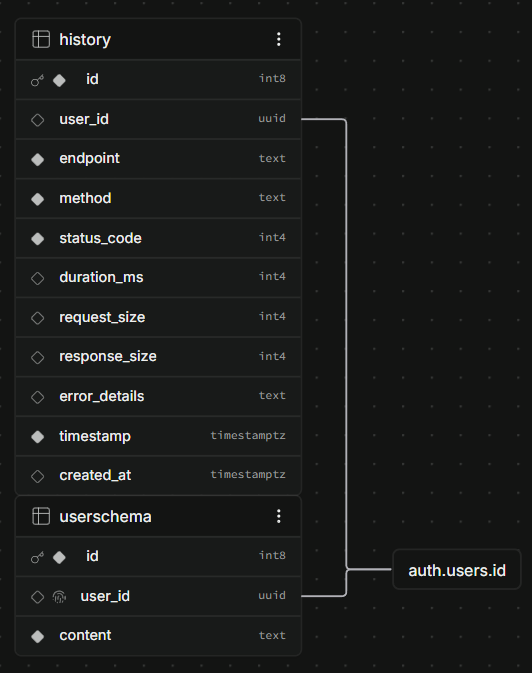

1. Deployment: [Vercel](https://swagger-editor-app-six.vercel.app/)

2. Video breakdown: [Youtube](https://www.youtube.com/watch?v=DSE4uTGFUFw)

3. How to run it locally

Create .env.local in the root

With this lines:

```javascript
NEXT_PUBLIC_SUPABASE_URL = 'https://vjdnmpuimmjleqknqqtu.supabase.co';
NEXT_PUBLIC_SUPABASE_PUBLISHABLE_KEY = 'sb_publishable_2hMafG7r5oAld7lOgZmbwA_9mzq3wwj';
```

4. Or create your own supabase with built-in authentication:



<details>
<summary>History</summary>

```sql
-- Users are automatically created by Supabase Auth

-- Table
CREATE TABLE history (
id BIGSERIAL PRIMARY KEY,
user_id UUID REFERENCES auth.users(id) ON DELETE CASCADE,
endpoint TEXT NOT NULL,
method TEXT NOT NULL,
status_code INTEGER NOT NULL,
duration_ms INTEGER,
request_size INTEGER,
response_size INTEGER,
error_details TEXT,
timestamp TIMESTAMP WITH TIME ZONE DEFAULT NOW() NOT NULL,
created_at TIMESTAMP WITH TIME ZONE DEFAULT NOW()
);

-- Index for fast queries
CREATE INDEX idx_history_user_id ON history(user_id);
CREATE INDEX idx_history_timestamp ON history(timestamp DESC);

-- RLS
ALTER TABLE history ENABLE ROW LEVEL SECURITY;

-- Users can only see their own history
CREATE POLICY "Users can view own history"
ON history
FOR SELECT
USING (auth.uid() = user_id);

-- Users can insert their own history
CREATE POLICY "Users can insert own history"
ON history
FOR INSERT
WITH CHECK (auth.uid() = user_id);
```

</details>


<details>
<summary>Saved User Specification</summary>

```sql
-- Table
CREATE TABLE userschema (
id BIGSERIAL PRIMARY KEY,
user_id UUID REFERENCES auth.users(id) ON DELETE CASCADE UNIQUE,
content TEXT NOT NULL
);

-- RLS
ALTER TABLE userschema ENABLE ROW LEVEL SECURITY;

-- Users can manage own spec
CREATE POLICY "Users can manage own spec"
ON userschema
USING (auth.uid() = user_id)
WITH CHECK (auth.uid() = user_id);
```

</details>